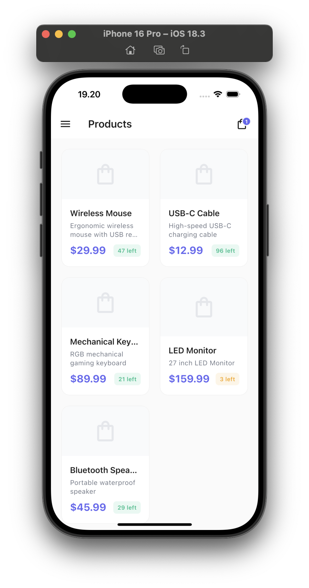
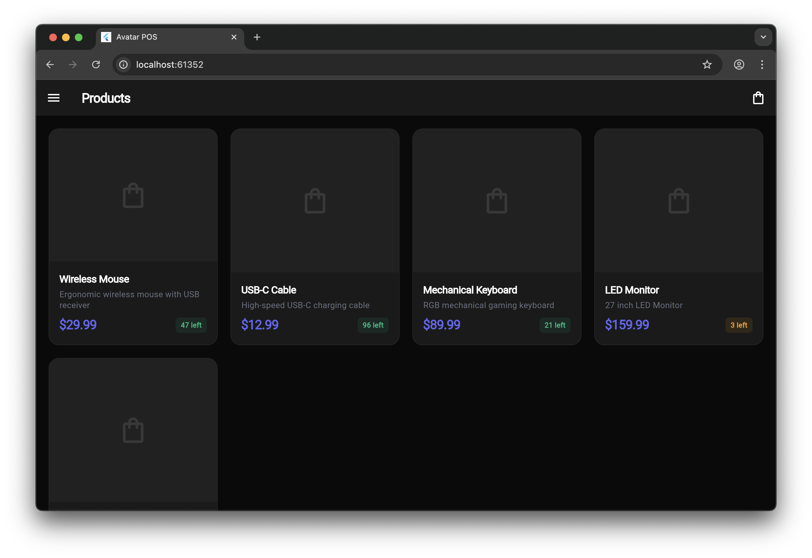

# Avatar POS

A modern Point of Sale system built with Flutter and Supabase. Runs on Android, iOS, Web, Windows, and macOS.

[](https://flutter.dev)
[](https://supabase.com)
[](https://avatar_pos.muhtadi.dev/)

---

## Features

- 🛍️ Product management with categories
- 🛒 Shopping cart with quantity management
- 💳 Checkout and payment processing
- 📊 Transaction history
- 🔐 User authentication (Supabase Auth)
- 📦 Automatic stock management
- 🎨 Light/dark theme support
- 🌍 Cross-platform (Android, iOS, Web, Windows, macOS)

---

## 🎮 Live Demo

Try out Avatar POS without any installation!

**🌐 Web Demo:** [https://avatar_pos.muhtadi.dev/](https://avatar_pos.muhtadi.dev/)

**Test Account:**

```
Email: test@mail.com
Password: password
```

> **Note:** The demo uses a shared test database. Feel free to explore all features including adding products, creating transactions, and managing inventory!

---

## 📸 Screenshots

<table>
  <tr>
    <td></td>
    <td></td>
  </tr>
  <tr>
    <td align="center"><b>Mobile (iOS/Android)</b></td>
    <td align="center"><b>Web (Chrome/Safari/Firefox)</b></td>
  </tr>
</table>

---

## 🚀 Quick Start

### Prerequisites

- [Flutter SDK](https://flutter.dev/docs/get-started/install) (3.8.1 or higher)
- [Supabase Account](https://supabase.com) (free tier works great!)

### Installation

```bash
# Clone the repository
git clone https://github.com/imammuhtadi/avatar_pos.git
cd avatar_pos

# Install dependencies
flutter pub get

# Run code generation
dart run build_runner build --delete-conflicting-outputs
```

### Supabase Setup

Complete Supabase setup instructions are in the `supabase/` folder:

📁 **[supabase/SUPABASE_SETUP.md](supabase/SUPABASE_SETUP.md)** - Complete database setup guide including:

- Creating Supabase project
- Database tables and schema
- Functions and triggers
- Row Level Security (RLS) policies
- Sample data
- Environment variables setup

After setting up Supabase, create a `.env` file in the project root with your credentials.

### Run the App

```bash
flutter run -d chrome  # or macos, windows, android, ios
```

---

## 🌐 Cross-Platform Support

Avatar POS runs seamlessly on **all major platforms**:

| Platform       | Status   | Notes                         |
| -------------- | -------- | ----------------------------- |
| 🌐 **Web**     | ✅ Ready | Chrome, Safari, Firefox, Edge |
| 🍎 **macOS**   | ✅ Ready | Native desktop app            |
| 🪟 **Windows** | ✅ Ready | Native desktop app            |
| 📱 **Android** | ✅ Ready | Phone & Tablet                |
| 📱 **iOS**     | ✅ Ready | iPhone & iPad                 |

---

## 🏗️ Architecture

This project follows a **feature-first architecture** with clean separation of concerns:

### State Management

- **Riverpod** - Modern, compile-safe state management with code generation
- Providers are organized by feature for better modularity

### Routing

- **go_router** - Declarative routing with deep linking support
- Type-safe navigation across all platforms

### Code Generation

- **Freezed** - Immutable models with copyWith, equality, and serialization
- **json_serializable** - JSON serialization/deserialization
- **riverpod_generator** - Auto-generated providers

## 📁 Project Structure

```
lib/
├── core/                      # Core utilities and configurations
│   ├── constants/            # App-wide constants
│   ├── router/               # Routing configuration
│   ├── theme/                # Theme definitions
│   └── utils/                # Utility functions and extensions
├── features/                 # Feature modules
│   ├── home/                # Home/Dashboard feature
│   │   ├── models/          # Data models
│   │   ├── providers/       # State providers
│   │   ├── screens/         # UI screens
│   │   └── widgets/         # Feature-specific widgets
│   ├── products/            # Products management
│   ├── cart/                # Shopping cart
│   └── settings/            # App settings
└── shared/                  # Shared widgets and utilities
    └── widgets/             # Reusable widgets
```

## 🚀 Getting Started

### Prerequisites

- Flutter SDK (^3.8.1)
- Dart SDK (^3.8.1)

### Installation

1. **Clone the repository**

```bash
git clone <repository-url>
cd avatar_pos
```

2. **Install dependencies**

```bash
flutter pub get
```

3. **Run code generation**

```bash
dart run build_runner build --delete-conflicting-outputs
```

4. **Run the app**

```bash
# For development
flutter run

# For specific platform
flutter run -d chrome        # Web
flutter run -d macos         # macOS
flutter run -d windows       # Windows
flutter run -d android       # Android
flutter run -d ios           # iOS
```

## 🔧 Development

### Code Generation

When you modify models or providers with annotations, run:

```bash
# Watch mode (auto-regenerates on file changes)
dart run build_runner watch --delete-conflicting-outputs

# One-time build
dart run build_runner build --delete-conflicting-outputs
```

### Adding a New Feature

1. Create feature folder in `lib/features/`
2. Add models in `models/` with Freezed annotations
3. Create providers in `providers/` with Riverpod annotations
4. Build UI in `screens/` and `widgets/`
5. Add routes in `core/router/app_router.dart`
6. Run code generation

## Tech Stack

**Frontend:**

- Flutter 3.8.1+
- flutter_riverpod - State management
- go_router - Navigation
- freezed - Code generation for models

**Backend:**

- Supabase - PostgreSQL database, authentication, and REST API

**Other:**

- shared_preferences - Local storage
- flutter_dotenv - Environment variables
- intl - Internationalization

## 🧪 Testing

```bash
# Run all tests
flutter test

# Run with coverage
flutter test --coverage
```

## 📱 Platform-Specific Notes

### Web

- Uses IndexedDB for local storage via `shared_preferences`
- Responsive design adapts to mobile and desktop viewports

### Desktop (Windows/macOS)

- Native window chrome and menus
- Keyboard shortcuts supported

### Mobile (Android/iOS)

- Touch-optimized UI
- Native navigation patterns

## 🤝 Contributing

Contributions are welcome! Whether it's:

- 🐛 Bug reports
- 💡 Feature requests
- 📝 Documentation improvements
- 🔧 Code contributions

**How to contribute:**

1. Fork the repository
2. Create a feature branch (`git checkout -b feature/amazing-feature`)
3. Commit your changes (`git commit -m 'Add amazing feature'`)
4. Push to the branch (`git push origin feature/amazing-feature`)
5. Open a Pull Request

---

## License

MIT License - see [LICENSE](LICENSE) file for details.

## Author

Imam Muhtadi - [@imammuhtadi](https://github.com/imammuhtadi)
